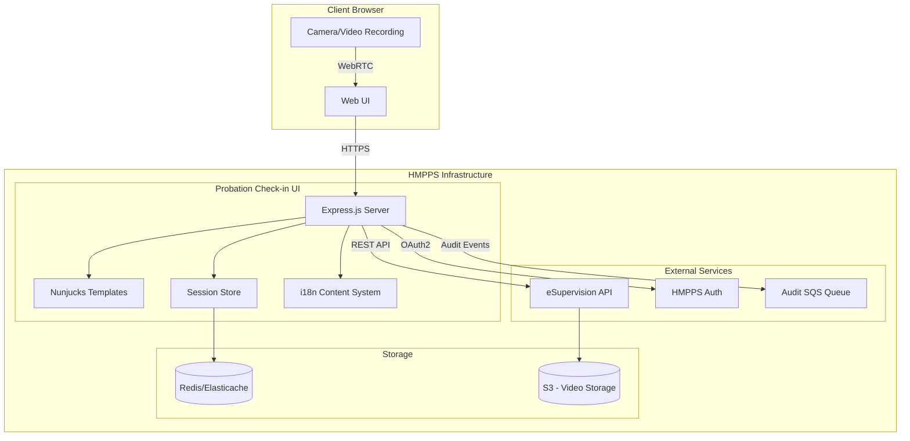
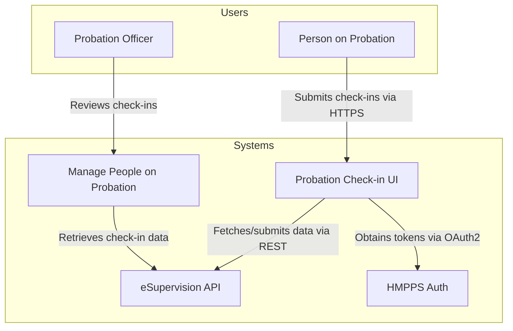
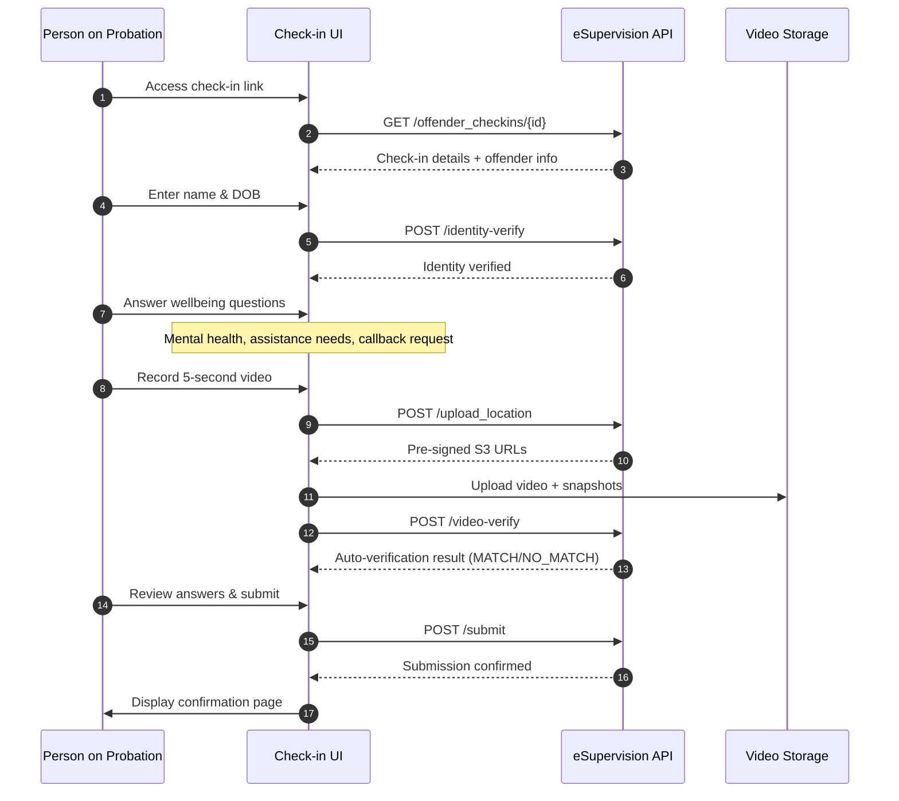
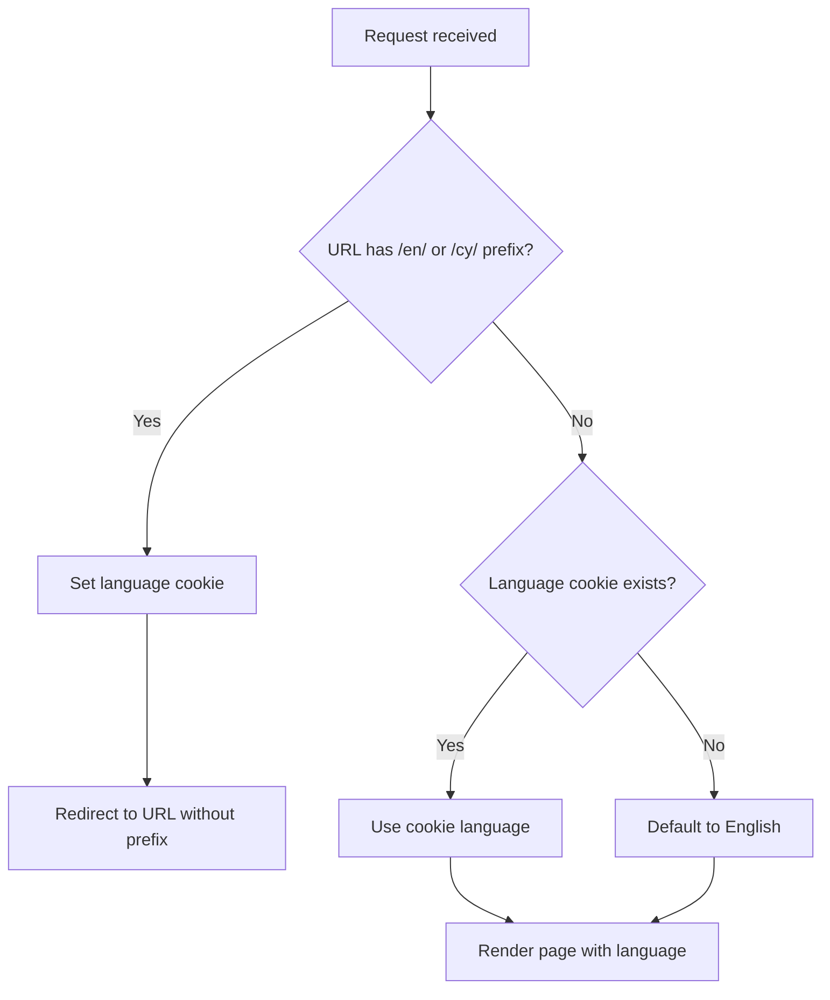
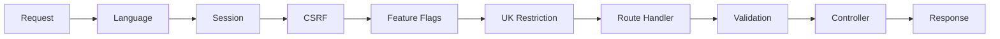
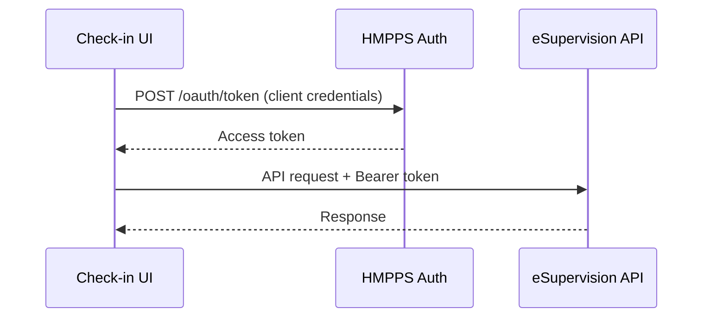
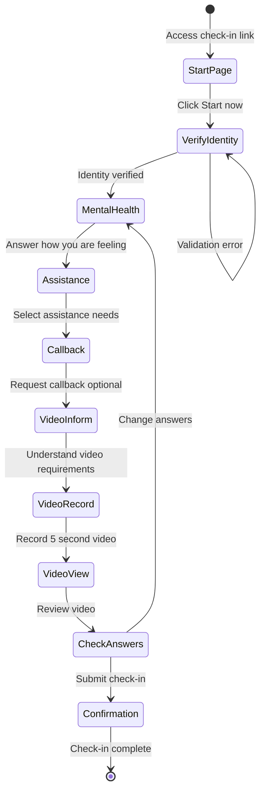

# HMPPS Probation Check-in UI

[](https://github-community.service.justice.gov.uk/repository-standards/hmpps-probation-check-in-ui)
[](https://ghcr.io/ministryofjustice/hmpps-probation-check-in-ui)

A web application that enables people on probation to complete online check-ins with their probation officers. The service allows users to verify their identity, answer wellbeing questions, record a video for identity verification, and submit their check-in remotely.

## Table of Contents

- [Architecture Overview](#architecture-overview)
- [High-Level Design](#high-level-design)
- [Project Structure](#project-structure)
- [Internationalisation (i18n)](#internationalisation-i18n)
- [Middleware](#middleware)
- [External Services](#external-services)
- [User Journey Flow](#user-journey-flow)
- [Getting Started](#getting-started)
- [Running Locally Against Remote Environments](#running-locally-against-remote-environments)
- [Development](#development)
- [Testing](#testing)
- [Deployment](#deployment)

## Architecture Overview



## High-Level Design

### System Context Diagram



### Check-in Submission Flow



## Project Structure

```
hmpps-probation-check-in-ui/
├── server/
│   ├── @types/                    # TypeScript type definitions
│   ├── content/                   # i18n content files
│   │   ├── en/                    # English translations
│   │   │   ├── common.json        # Common UI strings
│   │   │   ├── questions.json     # Question page content
│   │   │   ├── video.json         # Video recording content
│   │   │   ├── guidance.html      # Static guidance page (HTML)
│   │   │   └── ...
│   │   ├── cy/                    # Welsh translations (Cymraeg)
│   │   │   └── ...                # Same structure as en/
│   │   └── index.ts               # Content loader and exports
│   ├── controllers/
│   │   ├── submission/            # Check-in submission controllers
│   │   │   ├── indexController.ts
│   │   │   ├── verifyController.ts
│   │   │   ├── questionsController.ts
│   │   │   ├── videoController.ts
│   │   │   ├── checkAnswersController.ts
│   │   │   ├── confirmationController.ts
│   │   │   └── ...
│   │   └── submissionController.ts
│   ├── data/
│   │   ├── models/                # Data models/interfaces
│   │   │   ├── checkin.ts
│   │   │   ├── offender.ts
│   │   │   └── ...
│   │   ├── esupervisionApiClient.ts
│   │   └── hmppsAuditClient.ts
│   ├── middleware/
│   │   ├── languageMiddleware.ts  # i18n language detection
│   │   ├── validateFormData.ts    # Form validation
│   │   ├── restrictToUK.ts        # UK-only access control
│   │   ├── featureFlags.ts        # Feature flag handling
│   │   └── ...
│   ├── routes/
│   │   ├── index.ts               # Main router
│   │   └── submissionRoutes.ts    # Check-in submission routes
│   ├── schemas/
│   │   └── submissionSchemas.ts   # Zod validation schemas
│   ├── services/
│   │   ├── esupervisionService.ts # eSupervision API wrapper
│   │   └── auditService.ts        # Audit logging service
│   ├── utils/
│   │   ├── nunjucksSetup.ts       # Template engine configuration
│   │   ├── contentPageLoader.ts   # HTML content page loader
│   │   └── ...
│   ├── views/
│   │   ├── layouts/               # Page layouts
│   │   ├── pages/                 # Page templates
│   │   │   ├── submission/        # Check-in flow pages
│   │   │   │   ├── index.njk
│   │   │   │   ├── verify.njk
│   │   │   │   ├── questions/
│   │   │   │   ├── video/
│   │   │   │   └── ...
│   │   │   ├── guidance.njk
│   │   │   ├── accessibility.njk
│   │   │   └── privacy.njk
│   │   └── partials/              # Reusable template components
│   ├── app.ts                     # Express application setup
│   └── config.ts                  # Application configuration
├── assets/
│   ├── js/                        # Client-side JavaScript
│   │   └── video.js               # Video recording functionality
│   ├── scss/                      # Stylesheets
│   └── images/                    # Static images
├── integration_tests/
│   ├── e2e/                       # End-to-end Cypress tests
│   └── pages/                     # Page object models
├── esbuild/                       # Build configuration
├── docker-compose.yml             # Local development setup
└── package.json
```

## Internationalisation (i18n)

The application supports English (`en`) and Welsh (`cy`) languages using a custom content system.

### Content Structure

Content is organised in two formats:

1. **JSON files** - For structured, translatable strings (questions, buttons, labels)
2. **HTML files** - For static content pages (guidance, accessibility, privacy)

```
server/content/
├── en/
│   ├── common.json          # {"back": "Back", "continue": "Continue", ...}
│   ├── questions.json       # Question page content
│   ├── guidance.html        # Full HTML content
│   └── ...
├── cy/
│   ├── common.json          # {"back": "Yn ôl", "continue": "Parhau", ...}
│   ├── questions.json       # Welsh translations
│   ├── guidance.html        # Welsh HTML content
│   └── ...
└── index.ts                 # Content loader
```

### Language Detection Flow



### Using Translations in Templates

```njk
{# Using the t() translation function #}
<a href="/back">{{ t('common.back') }}</a>

{# Using getContent() for structured content #}

<h1>{{ content.title }}</h1>

{# Content loaded from HTML files #}

{{ pageContent.content | safe }}
```

### Language Toggle

Users can switch languages via the header toggle. Clicking switches the URL prefix:
- `/guidance` → `/cy/guidance` (sets Welsh cookie, redirects back)
- `/cy/guidance` → `/en/guidance` (sets English cookie, redirects back)

## Middleware

| Middleware | File | Description |
|------------|------|-------------|
| **Language** | `languageMiddleware.ts` | Detects language from URL/cookie, provides `t()` and `getContent()` helpers |
| **Form Validation** | `validateFormData.ts` | Validates form submissions against Zod schemas |
| **Session Protection** | `submissionMiddleware.ts` | Protects routes requiring verified session |
| **Store Form Data** | `storeFormDataInSession.ts` | Persists form data to session |
| **Populate Errors** | `populateValidationErrors.ts` | Populates validation errors for templates |
| **Feature Flags** | `featureFlags.ts` | Controls feature availability |
| **UK Restriction** | `restrictToUK.ts` | Restricts access to UK-based users |
| **Async Handler** | `asyncMiddleware.ts` | Wraps async handlers for error handling |
| **CSRF Protection** | `setUpCsrf.ts` | Cross-site request forgery protection |
| **Web Security** | `setUpWebSecurity.ts` | Security headers (helmet) |

### Request Flow



## External Services

### eSupervision API

The primary backend API for check-in management.

| Endpoint | Method | Description |
|----------|--------|-------------|
| `/offender_checkins/{id}` | GET | Retrieve check-in details |
| `/offender_checkins/{id}/identity-verify` | POST | Verify user identity (name + DOB) |
| `/offender_checkins/{id}/upload_location` | POST | Get pre-signed S3 URLs for video upload |
| `/offender_checkins/{id}/video-verify` | POST | Auto-verify identity from video snapshots |
| `/offender_checkins/{id}/submit` | POST | Submit completed check-in |
| `/offender_checkins/{id}/log-event` | POST | Log check-in events for audit |

### HMPPS Auth

OAuth2 authentication service for obtaining system tokens.



### Redis/Elasticache

Distributed session storage for multi-pod deployments.

### Audit SQS Queue

Audit events are published to an SQS queue for compliance tracking.

## User Journey Flow



## Getting Started

### Prerequisites

- Node.js 20.x (use `nvm install` to match `.nvmrc`)
- Docker and Docker Compose
- Redis (optional for local development)
- `kubectl` configured for Cloud Platform access (for remote environment testing)

### Quick Start

1. **Clone and install dependencies**
   ```bash
   git clone https://github.com/ministryofjustice/hmpps-probation-check-in-ui.git
   cd hmpps-probation-check-in-ui
   npm install
   ```

2. **Set up environment**
   ```bash
   cp .env.example .env
   # Edit .env with your configuration
   ```

3. **Start dependencies**
   ```bash
   docker compose up -d
   ```

4. **Run the application**
   ```bash
   npm run start:dev
   ```

5. **Access the application**
   - Open http://localhost:3000
   - Use a valid check-in UUID from the eSupervision API

### Environment Variables

| Variable | Description | Default |
|----------|-------------|---------|
| `ESUPERVISION_API_URL` | eSupervision API base URL | `http://localhost:8080/v2` |
| `HMPPS_AUTH_URL` | HMPPS Auth URL | `http://localhost:8090/auth` |
| `CLIENT_CREDS_CLIENT_ID` | OAuth client ID | Required in production |
| `CLIENT_CREDS_CLIENT_SECRET` | OAuth client secret | Required in production |
| `SESSION_SECRET` | Session encryption key | Required in production |
| `REDIS_ENABLED` | Enable Redis session store | `false` |
| `REDIS_HOST` | Redis host | `localhost` |
| `WEB_SESSION_TIMEOUT_IN_MINUTES` | Session timeout | `120` |
| `OFFENDER_SESSION_TIMEOUT_IN_MINUTES` | Check-in session timeout | `30` |

## Running Locally Against Remote Environments

You can run the UI locally while pointing to DEV, PREPROD, or other remote environments. This is useful for testing against real data without deploying.

### Environment URLs

| Environment | eSupervision API URL | HMPPS Auth URL |
|-------------|---------------------|----------------|
| DEV | `https://esupervision-api-dev.hmpps.service.justice.gov.uk/v2` | `https://sign-in-dev.hmpps.service.justice.gov.uk/auth` |
| PREPROD | `https://esupervision-api-preprod.hmpps.service.justice.gov.uk/v2` | `https://sign-in-preprod.hmpps.service.justice.gov.uk/auth` |
| PROD | `https://esupervision-api.hmpps.service.justice.gov.uk/v2` | `https://sign-in.hmpps.service.justice.gov.uk/auth` |

### Sample .env Configuration for DEV

Create a `.env` file with the following configuration:

```bash
# Disable Redis for local development
REDIS_ENABLED=false
TOKEN_VERIFICATION_ENABLED=false

# Point to DEV environment
ESUPERVISION_API_URL=https://esupervision-api-dev.hmpps.service.justice.gov.uk/v2
HMPPS_AUTH_URL=https://sign-in-dev.hmpps.service.justice.gov.uk/auth

# OAuth client credentials (retrieve from Kubernetes secrets - see below)
CLIENT_CREDS_CLIENT_ID=<your-client-id>
CLIENT_CREDS_CLIENT_SECRET=<your-client-secret>
```

### Retrieving Secrets from Kubernetes

The OAuth client credentials are stored in Kubernetes secrets. Use the following commands to retrieve them.

#### Prerequisites

1. Ensure you have `kubectl` installed and configured
2. Connect to the Cloud Platform cluster:
   ```bash
   # Login to Cloud Platform
   kubectl config use-context live.cloud-platform.service.justice.gov.uk
   ```

#### Retrieve Client Credentials

**For DEV environment:**

```bash
# Set the namespace
NAMESPACE=hmpps-probation-check-in-ui-dev

# Get the secret and decode
kubectl get secret hmpps-probation-check-in-ui-client-creds \
  -n $NAMESPACE \
  -o jsonpath='{.data}' | jq -r 'to_entries[] | "\(.key): \(.value | @base64d)"'
```

**For PREPROD environment:**

```bash
NAMESPACE=hmpps-probation-check-in-ui-preprod

kubectl get secret hmpps-probation-check-in-ui-client-creds \
  -n $NAMESPACE \
  -o jsonpath='{.data}' | jq -r 'to_entries[] | "\(.key): \(.value | @base64d)"'
```

#### Alternative: Retrieve Individual Values

```bash
# Get CLIENT_CREDS_CLIENT_ID
kubectl get secret hmpps-probation-check-in-ui-client-creds \
  -n $NAMESPACE \
  -o jsonpath='{.data.CLIENT_CREDS_CLIENT_ID}' | base64 -d && echo

# Get CLIENT_CREDS_CLIENT_SECRET
kubectl get secret hmpps-probation-check-in-ui-client-creds \
  -n $NAMESPACE \
  -o jsonpath='{.data.CLIENT_CREDS_CLIENT_SECRET}' | base64 -d && echo
```

#### One-liner Script to Generate .env

```bash
#!/bin/bash
# generate-env.sh - Generate .env file from Kubernetes secrets

ENV_NAME=${1:-dev}
NAMESPACE="hmpps-probation-check-in-ui-$ENV_NAME"

# Determine URLs based on environment
case $ENV_NAME in
  dev)
    API_URL="https://esupervision-api-dev.hmpps.service.justice.gov.uk/v2"
    AUTH_URL="https://sign-in-dev.hmpps.service.justice.gov.uk/auth"
    ;;
  preprod)
    API_URL="https://esupervision-api-preprod.hmpps.service.justice.gov.uk/v2"
    AUTH_URL="https://sign-in-preprod.hmpps.service.justice.gov.uk/auth"
    ;;
  *)
    echo "Unknown environment: $ENV_NAME"
    echo "Usage: ./generate-env.sh [dev|preprod]"
    exit 1
    ;;
esac

# Get secrets
CLIENT_ID=$(kubectl get secret hmpps-probation-check-in-ui-client-creds \
  -n $NAMESPACE \
  -o jsonpath='{.data.CLIENT_CREDS_CLIENT_ID}' | base64 -d)

CLIENT_SECRET=$(kubectl get secret hmpps-probation-check-in-ui-client-creds \
  -n $NAMESPACE \
  -o jsonpath='{.data.CLIENT_CREDS_CLIENT_SECRET}' | base64 -d)

# Generate .env file
cat > .env << EOF
# Generated for $ENV_NAME environment
REDIS_ENABLED=false
TOKEN_VERIFICATION_ENABLED=false

# $ENV_NAME environment URLs
ESUPERVISION_API_URL=$API_URL
HMPPS_AUTH_URL=$AUTH_URL

# OAuth client credentials
CLIENT_CREDS_CLIENT_ID=$CLIENT_ID
CLIENT_CREDS_CLIENT_SECRET=$CLIENT_SECRET
EOF

echo "Generated .env file for $ENV_NAME environment"
```

**Usage:**

```bash
# Generate .env for DEV
./generate-env.sh dev

# Generate .env for PREPROD
./generate-env.sh preprod
```

### Running Against Remote Environment

Once your `.env` file is configured:

```bash
# Start the application
npm run start:dev

# Access at http://localhost:3000/{checkin-uuid}
```

### Security Considerations

- **Never commit `.env` files** containing real secrets to version control
- The `.env` file is already in `.gitignore`
- Rotate credentials if accidentally exposed
- Use DEV/PREPROD for testing, not PROD credentials locally

## Development

### Available Scripts

| Command | Description |
|---------|-------------|
| `npm run start:dev` | Start with hot reload |
| `npm run build` | Build for production |
| `npm run lint` | Run ESLint |
| `npm run lint-fix` | Fix linting issues |
| `npm run typecheck` | Run TypeScript compiler |
| `npm test` | Run unit tests |
| `npm run int-test` | Run integration tests |

### Code Style

- TypeScript strict mode enabled
- ESLint with HMPPS configuration
- Prettier for code formatting

### Adding a New Language

1. Create content directory: `server/content/{lang}/`
2. Copy English files and translate
3. Add language to `SUPPORTED_LANGUAGES` in `server/content/index.ts`
4. Update `pageTitles` in `server/utils/contentPageLoader.ts`

## Testing

### Unit Tests

```bash
npm test                    # Run all unit tests
npm test -- --watch        # Watch mode
npm test -- --coverage     # With coverage report
```

### Integration Tests (Cypress)

```bash
# Start dependencies
docker compose -f docker-compose-test.yml up -d

# Start app in test mode
npm run start-feature

# Run tests
npm run int-test           # Headless
npm run int-test-ui        # With Cypress UI
```

## Deployment

### Docker

```bash
docker build -t hmpps-probation-check-in-ui .
docker run -p 3000:3000 --env-file .env hmpps-probation-check-in-ui
```

### Cloud Platform

The application is deployed to the MoJ Cloud Platform Kubernetes cluster. See [Cloud Platform documentation](https://user-guide.cloud-platform.service.justice.gov.uk/) for details.

## Security

Our security policy is located [here](https://github.com/ministryofjustice/hmpps-probation-check-in-ui/security/policy).

## Change Log

A changelog for the service is available [here](./CHANGELOG.md).

## License

MIT License - see [LICENSE](LICENSE) for details.
